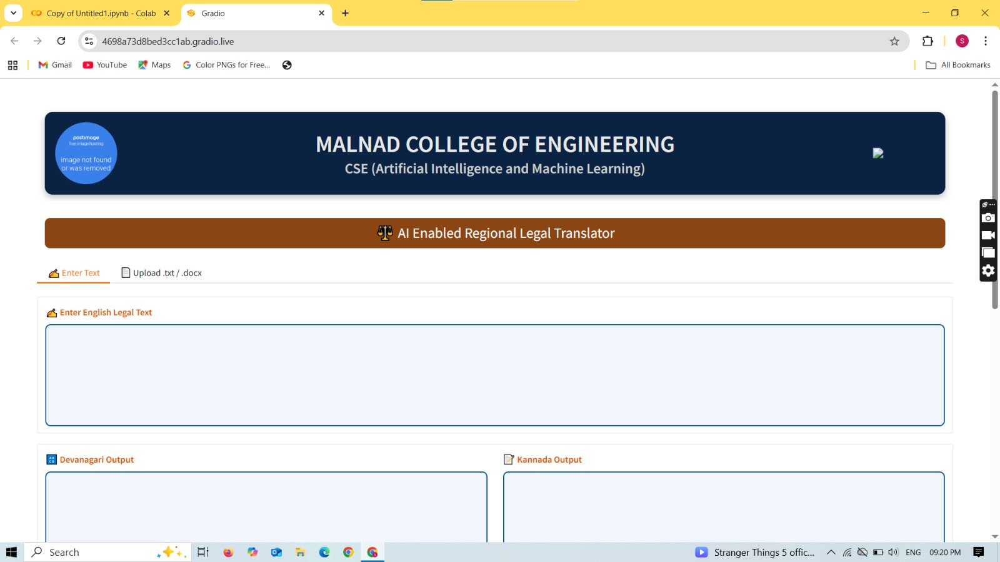
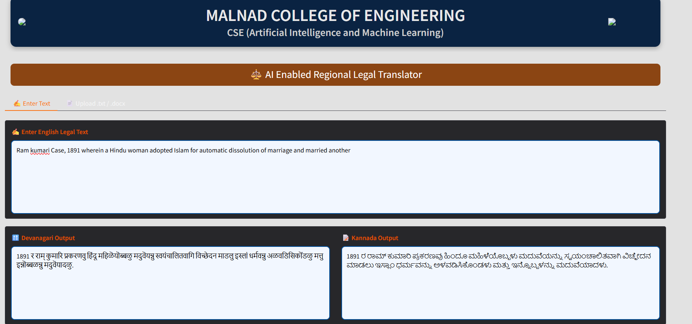
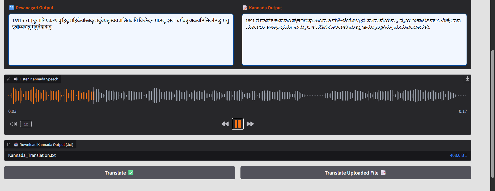

# AI Enabled Regional Legal Translator

## Overview

AI Enabled Regional Legal Translator is a Natural Language Processing based system that translates English legal documents into Kannada while preserving legal terminology and meaning.

## Features

- English to Kannada Legal Translation
- Legal Terminology Preservation
- Upload TXT and DOCX Files
- Kannada Translation Output
- Devanagari Transliteration
- Kannada Speech Generation
- Download Translated File
- Gradio Web Interface

## Technologies Used

- Python
- NLP
- Machine Learning
- Transformers
- Gradio
- gTTS
- Python-docx

## Project Interface

### Home Page



### Translation Output



### Speech Generation



## Installation

```bash
pip install -r requirements.txt
```
